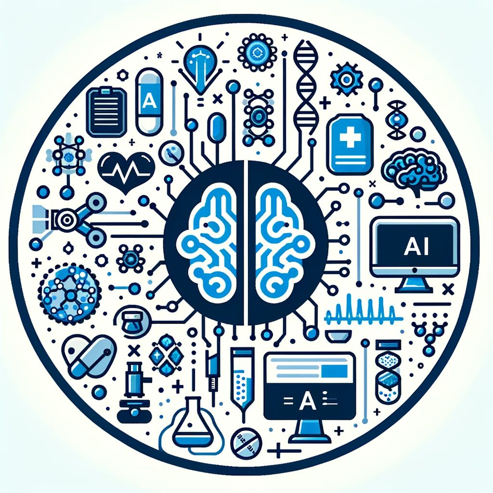

<h2 align="center">🔬 Day 5/366: AI's Revolution in Drug Discovery</h2>

🔬 <strong>Insightful Fact:</strong> The complex and costly process of drug discovery and development, typically spanning over a decade, is undergoing a radical change thanks to Artificial Intelligence (AI).

  

<h3>👩💻 AI: A Catalyst in Pharma</h3>

Far beyond a trendy term, AI stands as a pivotal force in medical advancements. It's streamlining the discovery of drugs by efficiently processing large data sets and pinpointing viable drug candidates with impressive speed and precision.

<h3>AI's Role in Drug Discovery and Development</h3>

AI has drastically altered the landscape of drug development. The traditional approach, often lengthy and costly, is being supplanted by AI's ability to swiftly sift through data, forecast compound behaviors, and quickly spot potential drugs.

<h4>Real-Life Example: Atomwise</h4>

Consider Atomwise, an innovator in AI-assisted drug discovery. They employ AI algorithms to foresee interactions between molecules and disease-related proteins, aiding in the identification of promising compounds.

<h3>The Impact of Atomwise</h3>
<ul>
  <li><strong>Rapid Screening:</strong> Atomwise's AI system, AtomNet, efficiently screens millions of compounds—a task that would otherwise take years.</li>
  <li><strong>Precision and Prediction:</strong> AtomNet excels in examining protein structures in 3D, predicting molecular interactions with high accuracy.</li>
  <li><strong>Wide-Ranging Applications:</strong> From rare diseases to widespread ailments like Ebola and MS, Atomwise's AI has diverse applications.</li>
  <li><strong>Strategic Partnerships:</strong> Collaborating with pharma giants and academic bodies, Atomwise leverages AI to expedite drug discovery globally.</li>
</ul>

<h3>Conclusion</h3>

With its promise of speed, accuracy, and efficiency, AI stands at the forefront of drug discovery, epitomized by Atomwise's innovative approaches.

<h3>Why This Is Game-Changing?</h3>
<ul>
  <li><strong>Speed:</strong> AI is revolutionizing the pace of new drug discoveries, bringing critical treatments to patients swiftly.</li>
  <li><strong>Cost Efficiency:</strong> AI reduces the financial burden of drug development, making healthcare more accessible.</li>
  <li><strong>Pioneering Innovation:</strong> AI is unlocking treatments for previously incurable diseases.</li>
</ul>

<h3>Engage with Us!</h3>

🤔 Are you intrigued by AI's transformative role in healthcare?

🌐 What do you foresee as the impact of AI in drug discovery in the coming years?

💬 Share your views and let's dive into how AI is forging a path towards a healthier future!

  <em>#AI #ML #spreadingaithroughsl</em>

